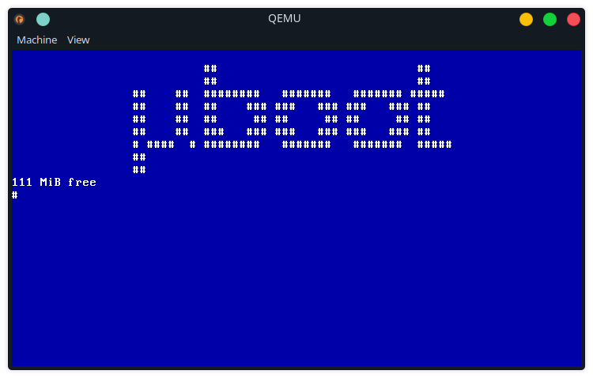

# μboot
A small (and very limited) bootloader

## What is it?

μboot is a small environment that allows a C program to run on "bare metal". It
does not require the typical `i686-elf-gcc` (or similar) cross compiler, and is
designed to work with a normal installation of `gcc` on an x86_64 computer. This
solution is somewhat unstable however, and is only used because it greatly
reduces the complexity to get started.

Calling it a "bootloader" is (currently) a bit of a misnomer because it can't
load any user defined applications at run time. This however is the end goal.

## How to use

To use μboot, you'll at the very minimum need some linux environment, which has
the tools `qemu`, `gcc`, `nasm`, and `dd` available. Once all the tools are
installed, you can run `make` to build or `make run` to both build and launch
qemu.

By default a hard disk image is created, 32MiB large (see `mkimg.sh` for more 
details). The bootloader's core image is stored within the space between the MBR
and the first partition.

## Architecture

There are 3 main components:

 1. First stage loader (boot sector)
 2. Second stage loader
 3. User program

The second stage loader and user program are linked together into one binary
file at compile time. To use this as a more general bootloader, this
functionality would need to be separated out further.

The second stage loader is stored in the space between the MBR and the first
partition. Currently work is ongoing to support the ext2 filesystem which should
enable loadable modules. Once these are supported, proper user programs which
are not linked at compile time should be fairly simple to implement.

### First Stage Loader

The first stage loader is implemented in `nasm` as it better supports the 16bit
code that is require when the machine is initialised. It is stored within the
boot sector of a drive (either a floppy or hard disk image). The first stage
loader uses BIOS interrupts to load the second stage loader from the disk that
has been booted.

### Second Stage Loader

The second stage takes care of the platform initialisation. This includes
enabling the A20 gate, setting up a very simple GDT, and switching to protected
mode. The second stage is written in gnu `as` assembly (AT&T syntax).

### User program

This is the program which is given control once the second stage has set
everything up. The entry point is `kernel_main`. This sets up the devices and
initialises the IDT so that interrupts can be used. Once setup is done, it jumps
to `main`, which should be defined in `user/main.c`. This is the actual user
program.

## Environment

At the moment a _very_ limited subset of functions inspired by (but not
necessarily compatible with) the POSIX standard library are provided in
`stdlib.h`. In addition the devices and kernel functions are accessible by their
respective headers.

## Acknowledgements

This project uses mpaland's printf library, which is under the MIT license. To
learn more about this project go to the repository page
[here](https://github.com/mpaland/printf).